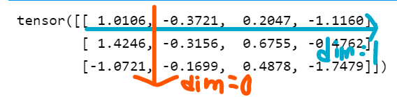
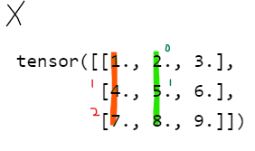
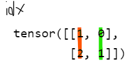
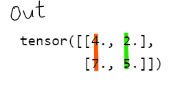
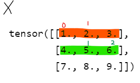
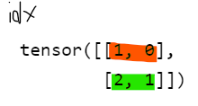
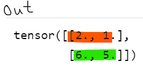

Pandas나 Pytorch에서는 연산을 적용할 차원(dimension)을 명시해야 하는 함수들이 있다. 그런데 차원을 잘못 명시해 에러가 나거나, (최악의 경우) 잘못된 결과를 얻어놓고 넘어가는 경우가 왕왕 있다.

> Note: pytorch에서는 dimension이지만 pandas에서는 axis이다. 

흔히 행별(row-wise) 연산의 index는 0, 열별(column-wise)의 그것은 1이라고 한다. 그런데 (3,4)의 shape을 가진 행렬 X의 **행별**합계를 `torch.sum(X, dim=0)`로 구하면 크기가 3이 아닌 4인 텐서, 즉 **열별** 합계를 구한다.


```python
import torch

X = torch.randn([3,4])
X
```


    tensor([[ 1.0106, -0.3721,  0.2047, -1.1160],
            [ 1.4246, -0.3156,  0.6755, -0.4762],
            [-1.0721, -0.1699,  0.4878, -1.7479]])


```python
# dim = 0, i.e. row-wise
row_wise = torch.sum(X, dim=0).shape

# dim = 1, i.e. column-wise
col_wise = torch.sum(X, dim=1).shape

print(f'dim=0 : {row_wise} ::: dim=1 : {col_wise}')
```

    dim=0 : torch.Size([4]) ::: dim=1 : torch.Size([3])


#### 차원이 무너지는 경우: dim == 축소되는 차원

[torch.sum() 설명](https://pytorch.org/docs/stable/generated/torch.sum.html?highlight=torch%20sum#torch.sum)을 보면 파라미터 `dim`을  "the dimension or dimensions to reduce"라고 설명한다. 즉 위 예시에서 크기가 (3,4)인 X를 두고 `torch.sum(X, dim=0)`를 하면 크기가 (3,4)에서 (4)가 되고 `torch.sum(X, dim=1)`를 하면 (3)이 된다.



#### 차원이 유지되는 경우: dim?

손쉽게 결과적으로 축소되는 축을 dim으로 주면 되는 함수도 있는 반면, 좀 더 고심해야 하는 함수도 있다. 예를 들어 `torch.gather(input, dim, index)`는 주어진 차원과 인덱스에 맞는 input의 원소들을 모아 리턴한다.  

[**torch.gather**](https://pytorch.org/docs/stable/generated/torch.gather.html)
`torch.gather(input, dim, index)` 함수의 연산을 설명하자면
1. `index`의 크기와 `out`의 크기는 동일 
2. `input`의 차원과 `index`의 차원은 동일 (e.g. 3차원 인풋이면 인덱스도 3차원으로)
3. `index`의 값은 `input`의 `dim`차원에만 영향을 미침. 

예를 들어 `input`이 2차원 행렬이고, dim = 0 일 때: 우선 out[i][j] = input[?][j]이다 (1차원, 즉 j 값은 `index`와 무관하게 동일). 물음표에 해당하는 0차원 index는 주어진 `index`의 (i,j) 원소이다.  


```python
# e.g.1 dim=0
X = torch.Tensor([[1, 2, 3],
                  [4, 5, 6],
                  [7, 8, 9]])
index = torch.tensor([[1,0],
                      [2,1]])
out_dim_0 = torch.gather(X, dim=0, index=index)
out_dim_0

```


    tensor([[4., 2.],
            [7., 5.]])







```python
# e.g.2 dim=1
out_dim_1 = torch.gather(X, dim=1, index=index)
out_dim_1
```


    tensor([[2., 1.],
            [6., 5.]])





